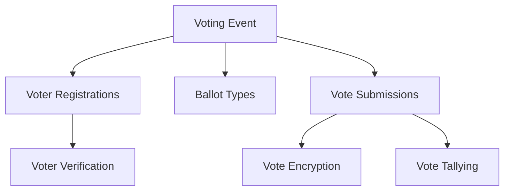

# Tested Voting Collector

A decentralized blockchain-based voting system for secure, transparent, and verifiable vote collection and tallying.

## Overview

Tested Voting Collector provides a robust platform for:
- Creating and managing voting events
- Ensuring vote integrity through blockchain technology
- Supporting various voting mechanisms
- Providing transparent and auditable voting processes
- Protecting voter privacy and preventing double-voting

## Architecture

Tested Voting Collector uses a secure, modular voting infrastructure:



Core Components:
- Voting Events: Top-level container for voting processes
- Voter Registrations: Mechanism for voter enrollment and validation
- Ballot Types: Support for different voting styles and formats
- Vote Submissions: Secure mechanism for casting votes
- Vote Tallying: Transparent and verifiable vote counting

## Contract Documentation

### Main Contract: voting-collector.clar

#### Status Constants
- `STATUS-PENDING` (1)
- `STATUS-ACTIVE` (2)
- `STATUS-CLOSED` (3)
- `STATUS-TALLIED` (4)
- `STATUS-DISPUTED` (5)

#### Role Constants
- `ROLE-ADMIN` (1)
- `ROLE-ELECTION-MANAGER` (2)
- `ROLE-AUDITOR` (3)

## Getting Started

### Prerequisites
- Clarinet installed
- Stacks wallet for deployment/interaction

### Usage Examples

1. Create a voting event:
```clarity
(contract-call? .voting-collector create-voting-event 
    "City Mayor Election" 
    "Annual municipal leadership selection" 
    u1000)
```

2. Register a voter:
```clarity
(contract-call? .voting-collector register-voter 
    u1 
    'ST1PQHQKV0RJXZFY1DGX8MNSNYVE3VGZJSRTPGZGM)
```

3. Submit a vote:
```clarity
(contract-call? .voting-collector submit-vote 
    u1 
    'ST1PQHQKV0RJXZFY1DGX8MNSNYVE3VGZJSRTPGZGM 
    (some "Candidate A"))
```

## Function Reference

### Voting Event Management

```clarity
(create-voting-event (name (string-ascii 100)) (description (string-utf8 500)) (deadline uint))
(register-voter (voting-event-id uint) (voter principal))
(update-voting-event-status (voting-event-id uint) (new-status uint))
```

### Voting Mechanisms

```clarity
(submit-vote (voting-event-id uint) (voter principal) (vote (optional (string-ascii 100))))
(tally-votes (voting-event-id uint))
(verify-vote-integrity (voting-event-id uint))
```

### Query Functions

```clarity
(get-voting-event (voting-event-id uint))
(get-voter-status (voting-event-id uint) (voter principal))
(get-vote-count (voting-event-id uint))
(get-vote-results (voting-event-id uint))
```

## Development

### Testing
1. Clone the repository
2. Install dependencies: `clarinet install`
3. Run tests: `clarinet test`

### Local Development
1. Start local chain: `clarinet console`
2. Deploy contract
3. Interact using Clarity console

## Security Considerations

1. Access Control
- Strict role-based permissions
- Multi-level authorization for critical actions
- Immutable voting records

2. Vote Integrity
- Cryptographic vote verification
- Prevention of double-voting
- Anonymous yet auditable voting process

3. Limitations
- Maximum voting duration
- Voter registration constraints
- Vote submission windows